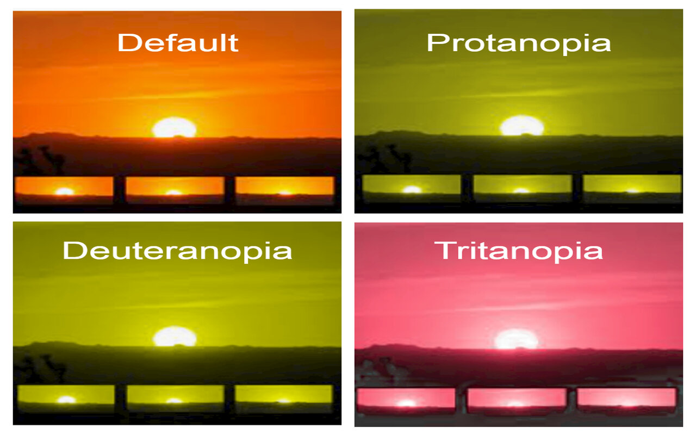

# Colourblind-Simulator-Developer-Tool-Chrome-Extension
Assists web developers in creating colourblind friendly web applications. 
Currently supports Protanopia, Deuteranopia and Tritanopia. Works with images, videos, and text on any website.

At the moment, this extension is pending review to be published to the Chrome Web Store.

However, you can still **use this extension by** :

  **1.** Extracting the Colourblind-Simulator-Developer-Tool-Chrome-Extension-master.zip file.  
  **2.** Going to chrome://extensions and enabling Developer Mode (Top right button).  
  **3.** Clicking on "Load unpacked" and uploading the Colourblind-Simulator-Developer-Tool-Chrome-Extension-master folder that is inside the Colourblind-Simulator-              Developer-Tool-Chrome-Extension-master folder.  
  

