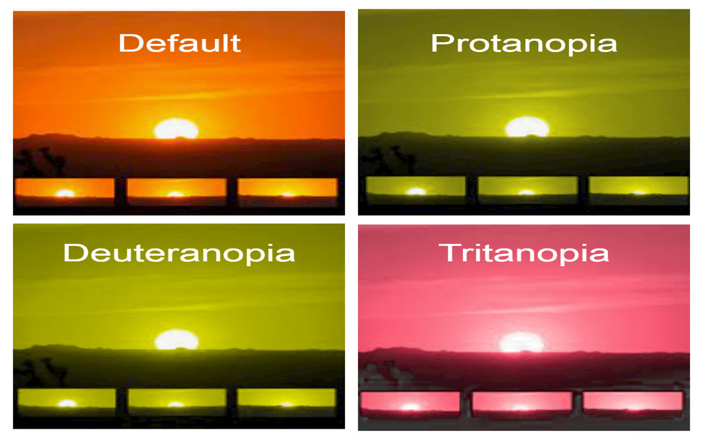

# Colourblind Simulator Developer Tool

A Chrome extension that helps web developers build colourblind-friendly websites by letting them preview any page the way people with colour vision deficiency see it.

**[Install from the Chrome Web Store](https://chrome.google.com/webstore/detail/colourblind-simulation-to/pngbanndhojopblfnihndgmflmohepom)**



## Features

- Simulates **Protanopia** (red-blind), **Deuteranopia** (green-blind) and **Tritanopia** (blue-blind)
- Works on any website, including images, videos and text
- One-click switching between modes from the popup
- Remembers your selected mode and highlights it when you reopen the popup
- Popup interface with light and dark themes that follow your system setting

## Usage

1. Open the website you want to test.
2. Click the extension icon in the Chrome toolbar.
3. Choose a mode. The page updates immediately.
4. Choose **Default** to return to normal colour vision.

The extension can't run on browser-internal pages such as `chrome://` pages or the Chrome Web Store.

## Install from source

1. Clone this repository:
   ```
   git clone https://github.com/MuhammadNisarWCSS/Colourblind-Simulator-Developer-Tool-Chrome-Extension.git
   ```
2. Open `chrome://extensions` and turn on **Developer mode**.
3. Click **Load unpacked** and select the cloned folder.

## How it works

The content script (`filter.js`) injects a hidden SVG containing an `feColorMatrix` filter into the page. Each colour vision type maps to a different colour matrix, and the selected matrix is applied to the whole document through a CSS `filter: url(#colorFilter)` rule. Because the filter is applied to the root element, it affects everything the page renders, not just text or specific elements.

The popup saves the chosen mode with `chrome.storage.sync` and uses `chrome.scripting` to apply it to the active tab straight away. A background service worker (`background.js`) messages each tab when it finishes loading, so the saved mode is applied again on later page loads.

## Tech stack

- JavaScript
- Chrome Extension APIs (Manifest V3): `storage`, `scripting`, `activeTab`
- SVG filters (`feColorMatrix`)
- HTML and CSS (popup)

## Project structure

| File | Purpose |
| --- | --- |
| `manifest.json` | Extension configuration and permissions |
| `popup.html`, `popup.css`, `popup.js` | Popup interface and mode selection |
| `filter.js` | Content script that creates and applies the colour filter |
| `background.js` | Service worker that sets the default mode on install and re-applies the filter whenever a tab finishes loading |

## Status

Version 1.0.0. The first version was reviewed and approved by Google in June 2022 and is published on the Chrome Web Store.
